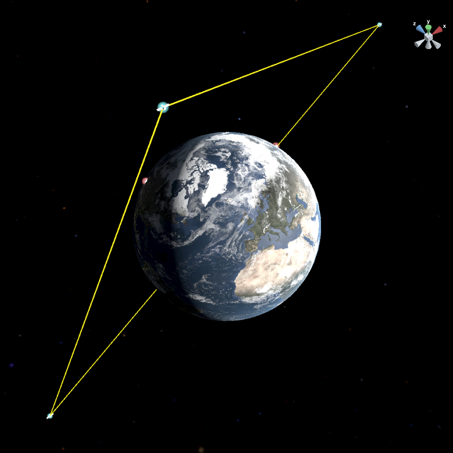
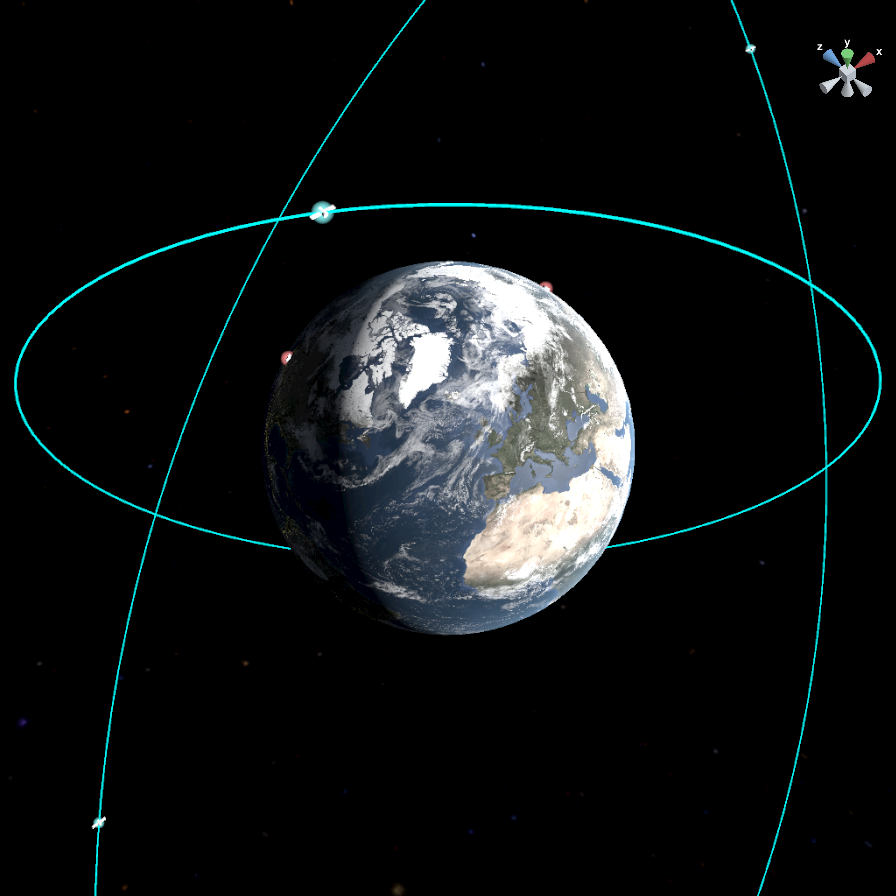
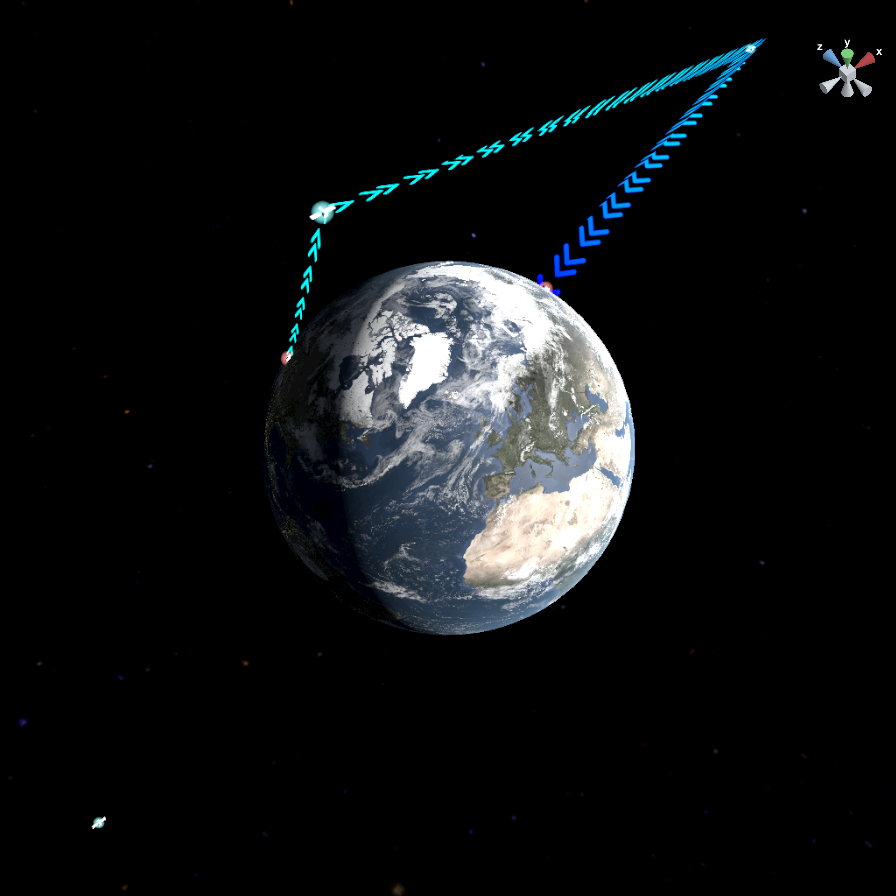
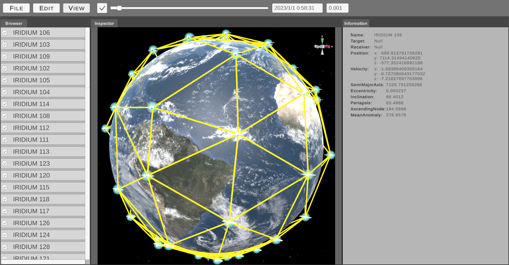
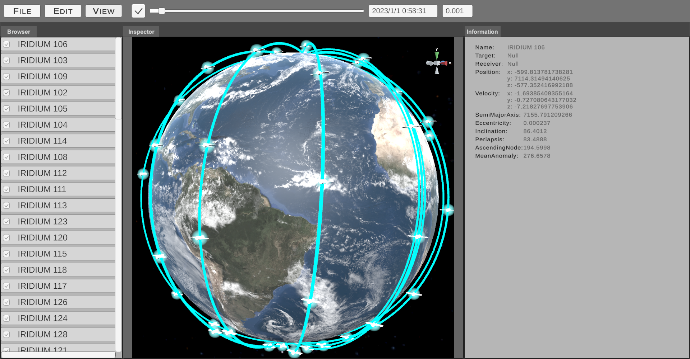

# Simulation Platform for Space Information Network

## Features

### Objects Movement and Communication

|          Links           |          Orbits           |          Routes           |
| :----------------------: | :-----------------------: | :-----------------------: |
|  |  |  |

### Constellation Simulation

|           Iridium Links            |           Iridium Orbits            |
| :--------------------------------: | :---------------------------------: |
|  |  |

## Instructions

### Supported Formats

- TLE
- JSON (Following the schema exported from the program)

### Satellite Data

Some satellite data is available on the following websites:

- [AMSAT](https://www.amsat.org/tle/)
- [N2YO](https://www.n2yo.com/satellites/)

### Useful Links

- [Keplerian Elements Tutorial](https://www.amsat.org/keplerian-elements-tutorial/)
- [Classical Orbital Elements](https://orbital-mechanics.space/classical-orbital-elements/classical-orbital-elements.html)
